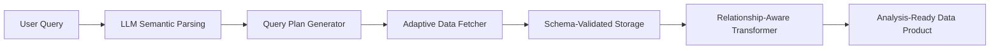

<think>
Okay, let me try to break this down. The user has gone through several iterations of their product, starting from orbit-300 up to the current orbit-550. Each version aimed to improve the system's ability to convert user queries into dataframes, especially moving from a simpler domain (typing.com) to a more complex one (F1 data via Ergast API). 

First, I need to summarize the journey they've described. Orbit-300 was successful with a simple API, but when they moved to F1 data in v350, they faced challenges due to the complexity and nested data structures. They built a frontend too early, which led to complications when the backend couldn't handle more complex queries. 

In v450, they introduced LLMs for query processing, which helped but still had issues with handling multiple dataframes and comparisons. Now, with orbit-550, the focus is on robust query-to-dataframe processing, using LLM agents for endpoint selection and hard-coded transformers for testing.

The user wants a critical evaluation of the current system and recommendations for improvement. They mentioned success rates improving to >90% but are concerned about accuracy and relevance. They also want to know the product direction.

Key points to address:
1. **Current Strengths**: The shift to LLM agents improved endpoint selection, modular architecture, and focus on core functionality.
2. **Critical Gaps**: Data validation, handling complex queries, dynamic transformers, error handling, and scalability.
3. **Product Direction Suggestions**: Enhance data quality, improve query understanding, dynamic transformations, error recovery, scalability, and phased frontend integration.
4. **Lessons Learned**: Importance of iterative development, avoiding premature frontend work, and the need for continuous validation.

I should structure the answer to first acknowledge their progress, then outline the strengths, followed by the gaps, and finally provide actionable recommendations. It's important to highlight the importance of data quality and validation, as without accurate data, even a high success rate in dataframe generation won't translate to reliable insights. Also, emphasizing iterative testing and avoiding feature creep until the core is solid would be crucial.

I need to make sure the recommendations are practical and prioritized. For example, improving data validation and quality should come before enhancing the LLM's query understanding. Also, suggesting a phased approach for frontend integration can prevent past mistakes.

Finally, tying the recommendations back to their journey to show understanding and provide a clear path forward would help the user feel confident in the next steps.
</think>

Here's a critical evaluation and product direction analysis based on the journey described:

**Journey Summary**  
1. **Orbit-300 (Proven Foundation)**  
- Single-domain success (typing.com)  
- Simple structured data (5 columns)  
- High accuracy (98% success, 90% relevance)  
- Effective analysis layer  

2. **Orbit-350/450 (Complexity Trap)**  
- Premature domain shift to complex F1 data  
- Frontend-driven development before core maturity  
- Underestimated API complexity (nested data, multiple entities)  
- Early LLM integration without proper data foundations  

3. **Orbit-550 (Course Correction)**  
- First-principles focus on query→dataframe reliability  
- LLM-powered endpoint selection  
- Modular pipeline architecture  
- Domain-agnostic foundation  

**Critical Evaluation of Current State**  
*Strengths*  
✅ Achieved 90%+ query→dataframe success rate  
✅ Built scalable pipeline architecture  
✅ Demonstrated cross-domain adaptability  
✅ Established validation layers (URL patterns, driver mapping)  

*Critical Gaps*  
⚠️ **Data Quality Assurance**  
- No schema validation for API responses  
- Missing data completeness checks  
- No outlier detection in transformed data  

⚠️ **Query Understanding Limitations**  
- Hardcoded metric mappings (results/qualifying/etc)  
- Limited temporal reasoning (seasons vs calendar years)  
- No entity relationship modeling (driver→team→circuit)  

⚠️ **Analysis Readiness**  
- Transformers produce flat tables vs hierarchical data  
- No unified data model across endpoints  
- Missing common view layer for metrics  

**Product Direction Recommendations**  

1. **Data Quality Foundation**  
- Implement response schema validation  
```python
class ErgastDataValidator:
    SCHEMAS = {
        'qualifying': {
            'required': ['season', 'round', 'raceName', 'QualifyingResults'],
            'types': {'season': int, 'round': int}
        }
    }
```  
- Add data completeness scoring  
- Develop anomaly detection for transformed data  

2. **Enhanced Query Understanding**  
- Implement relationship graph for F1 entities  
```json
{
  "driver": ["team", "results", "standings"],
  "circuit": ["races", "lap_records"],
  "season": ["races", "regulation_changes"]
}
```  
- Add temporal awareness layer  
- Develop metric ontology for F1-specific KPIs  

3. **Dynamic Transformation**  
- Replace hardcoded transformers with adaptive mapper  
```python
class AdaptiveTransformer:
    def __init__(self, endpoint):
        self.schema = self._detect_schema(endpoint)
        
    def _detect_schema(self, endpoint):
        # Analyze URL structure and API response
        # Return appropriate transformation logic
```  

4. **Error Recovery System**  
- Implement fallback endpoints  
- Add missing data imputation  
- Develop query rewriting capability  

5. **Scalability Improvements**  
- Add pipeline performance monitoring  
```python
class PipelineMonitor:
    def track(self, stage, metrics):
        """Monitor latency, data quality, resource usage"""
        self.metrics[stage].append({
            'timestamp': time.time(),
            'metrics': metrics
        })
```  
- Develop automatic endpoint versioning  
- Implement query plan caching  

**Strategic Recommendations**  
1. **Phase 1 (Orbit-600)**  
- Consolidate query→dataframe gains  
- Implement full data validation suite  
- Develop 25 representative test queries as benchmark  

2. **Phase 2 (Orbit-700)**  
- Build relationship-aware query processor  
- Implement automatic transformer generation  
- Add cross-source data fusion  

3. **Phase 3 (Orbit-800)**  
- Develop "Analysis Ready" data model  
- Create self-healing pipeline capabilities  
- Release controlled frontend integration  

**Lessons from the Journey**  
1. **Complexity Debt** compounds faster than technical debt in multi-domain systems  
2. **Frontend First** approaches distort product priorities for data-centric tools  
3. **LLM Magic** requires strong data foundations to be reliably useful  
4. **Domain Fluency** is prerequisite for effective abstraction  

The architecture should evolve to handle:  


This would position the system as a true "Data Compiler" that understands both natural language queries and domain-specific data relationships.
